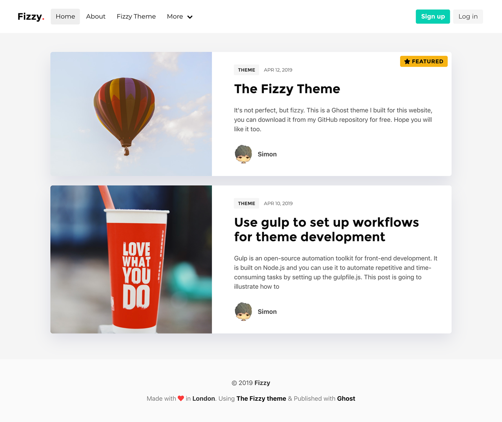

# The Fizzy Theme

[](https://fizzy.cc/)
[](https://github.com/TryGhost/Ghost)
[](https://github.com/huangyuzhang/Fizzy-Theme/)
[](https://github.com/huangyuzhang/Fizzy-Theme/network)
[](https://github.com/huangyuzhang/Fizzy-Theme/stargazers)

A tasty blogging theme for Ghost :ghost:

If you want to take advantage of all the features of this theme, please read this page.

[中文文档](./README-zh.md)



## :wrench: Installation

Download the latest [release](https://github.com/huangyuzhang/fizzy-theme/releases/) and upload the zip file at your Ghost admin > Setting > Design.

## :movie_camera: Demo

My blog [Fizzy.cc](https://fizzy.cc) is currently using this theme.

Use this [issue](https://github.com/huangyuzhang/Fizzy-Theme/issues/20) to add your site with Fizzy Theme.

## :tropical_drink: Features and Usage

### Logo
If only **site icon** is uploaded, the Logo area will display the **icon** and followed by the **Site name** then a dot colored as the **main color**, e.g.:

 

If **site logo** is uploaded, then the Logo area will only display the **site logo**. 

> Note: Since the top navbar is colored with white background, it would be better to use a dark/colorful logo.

### i18n
You can change the theme's language by configure in Ghost Admin -> General -> "Publication Language". Also, you need to copy the `en.json` file within the `locales` folder, and rename it to your language, e.g. `es.json`. Then modify the translations within it. Finally, if you changed the json file after you upload or update the Fizzy theme, you need to restart the ghost to refresh the `json` file.

Please help us to translate Fizzy into your language by Pull Request.

### Internal tags
Internal tags start with `#`, after creating it will displayed as internal tag automatically. Internal tags will not be displayed in front-end. So far the Fizzy Theme support the following internal tags:
- **Carousel**: Use internal tag `#carousel`(slug:`hash-carousel`) to add posts into carousel in homepage (see [Showcase](#showcase)). 
- **No Index**: Use internal tag `#noindex`(slug:`hash-noindex`) to exclude posts from listing in home page. 
> limitation: hiding posts with `#noindex` tag, but the number of posts displayed for that page will change as well.

### Showcase
The showcase section is built to highlight posts. It is available only on the homepage. Insert the following code into Ghost Admin -> Code injection -> `Site Header` to enable the showcase:

```javascript
<script>
  var show_showcase = true; //default: false
</script>
```

The left slider carousel part detects the internal tag `#carousel`. The right part will display 2 featured posts.


### Custom Templates
Open the gear icon ⚙ while editing a post or page, scroll to the bottom and change `Template` option.
- **Tag Archive**: used for listing all tags/topics in one page. ([demo](https://fizzy.cc/tag/))
- **Post Archive**: used for listing all posts in one page. ([demo](https://fizzy.cc/archive/))
- **Full Width**: full width post. ([demo](https://fizzy.cc/fizzy-theme/))
- **Post With TOC**: TOC-enabled post, details in [#TOC](#toc). ([demo](https://fizzy.cc/fizzy-theme/))
- **Report**: special layout for academic report (todo)

### Custom CSS
Simply edit the variables in `assets/css/custom.css` to customize your theme coloring.

### Custom Footer Text
By default, your **site description** (Ghost Admin -> General) will be displayed in the footer text. If you need to change it, define a variable `footer_text` in the `Site Header` as below:

```javascript
<script>
  var footer_text = "REPLACE WITH YOUR FOOTER TEXT HERE";
</script>
```

### :speech_balloon: Comment System
Due to Ghost itself doesn't have a comment system, we need to use third party solutions for this. Some options are: [DISQUS][disqus], [Gitalk][gitalk], [Valine][valine] and [Vssue][vssue]. By default, Fizzy has Gitalk and DISQUS integrated. Skip the following if you do not need the comment system.

**By default, the comment system is disabled.** To enable it, first insert the following code into `Post Header` for a single post or `Site Header` for the whole site at Ghost Admin -> Code injection to configure accordingly, then choose one of the comment systems below and follow the instruction.

```javascript
<script>
  var show_comment = true; //default: false
</script>
```

#### Gitalk (Recommended)
Gitalk is a Github issue based comment system. Automatically support `en`, `zh_CN`, `zh_TW`, `es` by detecting the language of user's navigator.
1. Register a new **GitHub Application**
2. Create a new **Github Repository** for your website
3. Insert the following code into Ghost Admin -> Code injection: `Site Footer`, and modify the configuration with your **Github App** & **Repository** from previous steps.

```javascript
<script>
  const gitalk = new Gitalk({
    clientID: 'GitHub Application Client ID',
    clientSecret: 'GitHub Application Client Secret',
    repo: 'GitHub repo',
    owner: 'GitHub repo owner',
    admin: ['GitHub repo owner and collaborators, only these guys can initialize github issues'],
    id: location.pathname,      // Ensure uniqueness and length less than 50
    distractionFreeMode: false  // Facebook-like distraction free mode
  });
  gitalk.render('gitalk-container');
</script>
```
> more usage guide and options please check [here](https://github.com/gitalk/gitalk#usage).


#### DISQUS
Insert the following code into Ghost Admin -> Code injection: `Site Header`, and modify the link with yours.
```javascript
<script>
    var disqus_link = 'https://YOURLINK.disqus.com/embed.js'; // change it with your DISQUS js link
</script>
```
If you want to change the comment system, you need to modify the code in `partial/post_comment.hbs`.

###  Code Highlight
Prism.js is used for syntax highlighting, the default languages and plugins used by Fizzy theme are:
  - **Languages**: Markup (e.g. HTML), CSS, C-like, JavasSript, Bash, Ruby, Git, JSON, Markdown, SQL, Python, R
  - **Plugins**: line-numbers, toolbar, show-language.

To customize this yourself, open [customize Prismjs][custom-prism] and choose the languages you need. Then download the js and css files to overwrite the `prism.js` and `prism.css` files in `assets` folder.

### TOC
There are two ways to control the TOC of a post:
1. insert the following code into `Post Header` for a single post or `Site Header` for the whole site;
    ```javascript
    <script>
        var show_toc = true; // enable TOC (default: false)
    </script>
    ```
2. Use custom post template `Post With Toc` to enable TOC. 
> **Prioty**: `template` > `Post Header` > `Site Header`

### Instant Search
To enable the Instant Search (added to top menu), first add a custom integration in Ghost Admin. Then copy the **Content API Key** and **API URL**.
Go to the Code injection, add the following code to the `Site Header`:
```javascript
<script>
  var show_search = true; // default:false
  var search_key = 'PASTE THE CODE YOU COPIED AS Content API Key';
  var search_url = 'PASTE THE CODE YOU COPIED AS API URL'; // it is usually your site url
</script>
```

### LaTeX support
Use `$`(inline) or `$$` to cover commands to render for LaTeX commands. ([examples](https://fizzy.cc/latex/))

### Components
- **Navigation**: You can modify `partials/navigation.hbs` to customize your dropdown menu, or delete the section if not needed.
- **Badge**: inclue `class="badge <color>"` to use badge (HTML only).([demo](https://fizzy.cc/fizzy-theme/#badge))
- **Posts per page**: change the number of `"posts_per_page": 8` in `package.json`

## :memo: Changelog

See [CHANGELOG.md](./CHANGELOG.md)

## :sunglasses: Author & Contributors

- Yuzhang Huang (Simon)

## :battery: Dependencies

- [Bulma][bulma] - CSS Framework
- [Prismjs][prismjs] - A lightweight syntax highlighter
- [JQuery][jquery] - A well-known JavaSript library (for tocify only now)
- [jQuery.tocify.js][tocify] - Table of Content generator (also JQuery-UI)
- [KaTeX][katex] - A faster LaTeX equation rendering library (since v0.3.0)
- [Gitalk][gitalk] - A Github issued based comment system (since v0.3.0)
- [ghost-search][ghost-search] - An instant search library using Ghost Content API (since v1.0.0)

## :bug: Bug Report & :dart: Features Request
If you find a bug, thinking about something to be improved or even want new features, please feel free to post an issue and label accordingly. 

Alternatively if you are familiar with them development, you could start to contribute to this project.

## :bulb: Contributing

1. Fork it (maybe star this too?)
2. Create your feature branch (`git checkout -b feature-fooBar`)
3. Commit your changes (`git commit -am 'Add something'`)
4. Push to the branch (`git push origin feature-fooBar`)
5. Create a new Pull Request

## :lock_with_ink_pen: License 

This project is licensed under the MIT License.

[bulma]: https://bulma.io/
[prismjs]: https://prismjs.com/
[jquery]: https://jquery.com/
[tocify]: http://gregfranko.com/jquery.tocify.js/
[mathjax]: https://www.mathjax.org/
[katex]: https://katex.org/
[disqus]: https://disqus.com/
[gitalk]: https://github.com/gitalk/gitalk
[valine]: https://github.com/xCss/Valine
[vssue]: https://github.com/meteorlxy/vssue
[custom-prism]: https://prismjs.com/download.html#themes=prism-tomorrow&languages=markup+css+clike+javascript+b
[ghost-search]: https://github.com/HauntedThemes/ghost-search